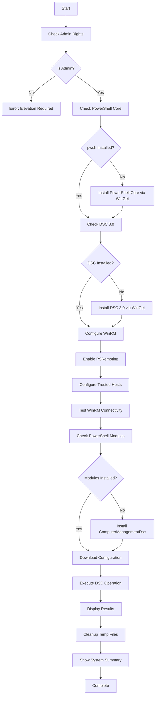

# Windows 11 Management Device - DSC 3.0 Configuration

## Overview

This repository contains a Microsoft Desired State Configuration (DSC) 3.0 solution for automating the configuration of Windows 11 management devices. The solution uses a bootstrap approach that allows you to configure devices without copying files locally - everything is executed directly from GitHub.

**Current Configuration:** Sets system timezone to Central Standard Time (Chicago)

**Future Plans:** This is a foundational configuration. Additional resources will be added over time to fully automate device setup.

## 🎯 Features

- ✅ **Zero-Touch Deployment**: Run directly from GitHub using a single command
- ✅ **Automatic Prerequisites**: Installs DSC 3.0 and required modules if missing
- ✅ **Comprehensive Logging**: Detailed logs with timestamps and color-coded output
- ✅ **Error Handling**: Robust error checking with helpful troubleshooting messages
- ✅ **Idempotent**: Safe to run multiple times without side effects
- ✅ **Test Mode**: Validate configuration before applying changes
- ✅ **Best Practices**: Follows Microsoft DSC 3.0 documentation standards

## 📋 Prerequisites

### System Requirements
- **Operating System**: Windows 11 (fully installed)
- **PowerShell**: Version 5.1 or later
- **Internet Access**: Required to download DSC and modules
- **Privileges**: Administrator rights (script enforces this)

### Software (Auto-Installed if Missing)
- **Microsoft DSC 3.0** - Core configuration management engine
- **PowerShell Core (pwsh)** - Modern PowerShell runtime (v7+)
- **WinRM Service** - Configured and enabled for remote management
- **ComputerManagementDsc Module** - PowerShell DSC resources for system configuration
- **WinGet** - Windows Package Manager (usually pre-installed on Windows 11)

## 🚀 Quick Start

**VERY IMPORTANT FOR TROUBLESHOOTING: ALL FILE NAMES IN THE REPO MUST BE LOWER CASE, OR YOU WILL GET 404: NOT FOUND ERRORS.**
**As soon as I went with lower-case for all project file names, I stopped seeing those 404 issues.**

### Option 1: One-Line Bootstrap (Recommended)

Run this single command from an **elevated PowerShell** prompt:

```powershell
irm https://raw.githubusercontent.com/yourorg/yourrepo/main/bootstrap-dsc3-onfiguration.ps1 | iex
```

**What This Does:**
1. Downloads the bootstrap script from GitHub
2. Executes it immediately (using `Invoke-Expression`)
3. The script handles everything else automatically

### Option 2: Download and Run

If you prefer to review the script first:

```powershell
# Download the bootstrap script
Invoke-WebRequest -Uri "https://raw.githubusercontent.com/yourorg/yourrepo/main/bootstrap-dsc3-onfiguration.ps1" -OutFile ".\bootstrap-dsc3-onfiguration.ps1"

# Review the script (optional but recommended)
Get-Content .\bootstrap-dsc3-onfiguration.ps1

# Run the script
.\bootstrap-dsc3-onfiguration.ps1
```

### Option 3: Test Before Applying

To check what would change **without making changes**:

```powershell
.\bootstrap-dsc3-onfiguration.ps1 -Operation Test
```

## 📖 Detailed Usage

### Bootstrap Script Parameters

```powershell
.\bootstrap-dsc3-onfiguration.ps1 [Parameters]

-ConfigurationUrl <string>
    URL to the DSC configuration YAML file
    Default: https://raw.githubusercontent.com/yourorg/yourrepo/main/timezone-config.dsc.yaml

-Operation <string>
    DSC operation to perform: Test, Set, or Get
    - Test: Check if system is in desired state (read-only)
    - Set: Enforce the desired state (makes changes)
    - Get: Retrieve current state
    Default: Set

-LogPath <string>
    Path where execution logs will be written
    Default: C:\Windows\Temp\DSC-Bootstrap.log
```

### Examples

**Test configuration without making changes:**
```powershell
.\bootstrap-dsc3-onfiguration.ps1 -Operation Test
```

**Apply configuration (default):**
```powershell
.\bootstrap-dsc3-onfiguration.ps1 -Operation Set
```

**Get current system state:**
```powershell
.\bootstrap-dsc3-onfiguration.ps1 -Operation Get
```

**Use custom configuration file:**
```powershell
.\bootstrap-dsc3-onfiguration.ps1 -ConfigurationUrl "https://raw.githubusercontent.com/yourorg/yourrepo/main/custom-config.dsc.yaml"
```

**Custom log location:**
```powershell
.\bootstrap-dsc3-onfiguration.ps1 -LogPath "C:\Logs\DSC-Config.log"
```

## 📁 Repository Structure

```
.
├── bootstrap-dsc3-onfiguration.ps1   # Main bootstrap script
├── timezone-config.dsc.yaml         # DSC configuration document
└── README.md                        # This file
```

## 🔧 How It Works

### Bootstrap Process Flow



### DSC Configuration Document

The configuration uses:
- **Schema**: DSC 3.0 configuration document schema
- **Adapter**: `Microsoft.Windows/WindowsPowerShell` (for MOF-based DSC resources)
- **Resource**: `ComputerManagementDsc/TimeZone`
- **Setting**: Timezone = "Central Standard Time"

## 🔍 Understanding the Output

### Successful Execution

```
[2025-11-03 10:30:00] [Info] ================================================================================
[2025-11-03 10:30:00] [Info] DSC 3.0 Bootstrap Script Started
[2025-11-03 10:30:00] [Info] ================================================================================
[2025-11-03 10:30:01] [Success] Administrator privileges confirmed
[2025-11-03 10:30:02] [Success] PowerShell Core is already installed: C:\Program Files\PowerShell\7\pwsh.exe
[2025-11-03 10:30:02] [Success] PowerShell Core Version: 7.4.0
[2025-11-03 10:30:03] [Success] DSC 3.0 is installed. Version: 3.0.0
[2025-11-03 10:30:04] [Info] WinRM service found. Current status: Running
[2025-11-03 10:30:05] [Success] WinRM connectivity test SUCCESSFUL
[2025-11-03 10:30:06] [Success] ComputerManagementDsc module is already installed
[2025-11-03 10:30:08] [Success] Configuration document downloaded successfully
[2025-11-03 10:30:18] [Success] DSC operation completed successfully!
[2025-11-03 10:30:18] [Success] All operations completed successfully!
```

### Test Operation Output

When running with `-Operation Test`, you'll see whether the system is in the desired state:

```
Resource: Configure System Timezone
Type: Microsoft.Windows/WindowsPowerShell
Status: NOT in desired state
Differing Properties: TimeZone
```

Or if already configured:

```
Resource: Configure System Timezone
Type: Microsoft.Windows/WindowsPowerShell
Status: In desired state
```

## 📝 Configuration File Details

### timezone-config.dsc.yaml

The configuration document is extensively commented and includes:

- **Schema validation** for proper DSC 3.0 format
- **Metadata** for tracking and documentation
- **Single resource** (TimeZone) configured for Central Standard Time
- **Inline documentation** explaining each section

### Supported Timezones

Common US timezones (run `tzutil /l` on Windows for full list):

- `Pacific Standard Time` - US West Coast
- `Mountain Standard Time` - US Mountain Region
- `Central Standard Time` - US Central Region (Chicago)
- `Eastern Standard Time` - US East Coast

To change the timezone, edit the `TimeZone` property in `timezone-config.dsc.yaml`:

```yaml
properties:
  IsSingleInstance: "Yes"
  TimeZone: "Eastern Standard Time"  # Change this value
```

## 🛠️ Troubleshooting

### Common Issues

#### 1. "Administrator privileges required"
**Solution**: Run PowerShell as Administrator
- Right-click PowerShell icon
- Select "Run as Administrator"

#### 2. "WinGet is not available"
**Solution**: Install Windows App Installer from Microsoft Store
- Or download manually from: https://aka.ms/getwinget

#### 3. "PowerShell Core (pwsh) command not found after installation"
**Solution**: 
- Close and reopen your PowerShell window (to refresh PATH)
- Or manually download from: https://aka.ms/powershell-release
- Verify installation: Run `pwsh --version` in a new terminal

#### 4. "Failed to download configuration document"
**Solution**: 
- Verify the URL is correct
- Check internet connectivity
- Ensure GitHub is accessible from your network

#### 6. "DSC operation failed"
**Solution**: 
- Review the detailed error in the log file
- Run with debug logging: add `--trace-level debug` to DSC command
- Verify ComputerManagementDsc module is installed: `Get-Module -ListAvailable ComputerManagementDsc`
- Check that PowerShell Core is working: `pwsh -Command "Get-TimeZone"`

#### 7. Configuration not applying
**Solution**:
- Verify you're running in an elevated PowerShell session
- Check the log file at `C:\Windows\Temp\DSC-Bootstrap.log`
- Ensure no other configuration management tools are conflicting

### Debug Mode

For detailed troubleshooting information, modify the DSC command in the bootstrap script to include debug logging:

```powershell
dsc config set --file "path\to\config.yaml" --trace-level debug
```

### Log Files

All execution details are logged to: `C:\Windows\Temp\DSC-Bootstrap.log`

View the log:
```powershell
Get-Content C:\Windows\Temp\DSC-Bootstrap.log
```

## 🔄 Extending the Configuration

### Adding More Resources

To add additional configuration tasks, edit `timezone-config.dsc.yaml` and add resources to the `resources` array:

```yaml
resources:
  - name: Configure System Timezone
    type: Microsoft.Windows/WindowsPowerShell
    properties:
      resources:
        - name: Set Central Standard Time
          type: ComputerManagementDsc/TimeZone
          properties:
            IsSingleInstance: "Yes"
            TimeZone: "Central Standard Time"
        
        # Add more resources here
        - name: Set Computer Name
          type: ComputerManagementDsc/Computer
          properties:
            Name: "MGMT-PC-001"
        
        - name: Install Windows Feature
          type: PSDesiredStateConfiguration/WindowsFeature
          properties:
            Name: "Hyper-V"
            Ensure: "Present"
```

### Available Resource Modules

Popular PowerShell DSC resource modules you can use:

- **ComputerManagementDsc**: Computer configuration (name, domain, timezone, etc.)
- **NetworkingDsc**: Network configuration
- **SecurityPolicyDsc**: Security settings
- **StorageDsc**: Disk and storage configuration
- **PSDesiredStateConfiguration**: Built-in Windows features

Browse available modules: https://www.powershellgallery.com

### Using Other DSC Resources

1. Find the module on PowerShell Gallery
2. Install it: `Install-Module -Name ModuleName`
3. Add it to your configuration document
4. Update the bootstrap script to install the module automatically

## 📚 Additional Resources

### Official Documentation

- **DSC 3.0 Overview**: https://learn.microsoft.com/en-us/powershell/dsc/overview?view=dsc-3.0
- **Configuration Documents**: https://learn.microsoft.com/en-us/powershell/dsc/concepts/configuration-documents/overview?view=dsc-3.0
- **DSC Resources**: https://learn.microsoft.com/en-us/powershell/dsc/concepts/resources/overview?view=dsc-3.0
- **ComputerManagementDsc**: https://github.com/dsccommunity/ComputerManagementDsc

### Community Resources

- **DSC GitHub Repository**: https://github.com/PowerShell/DSC
- **PowerShell Gallery**: https://www.powershellgallery.com
- **DSC Community**: https://discord.gg/powershell

## 🤝 Contributing

To improve or extend this configuration:

1. Fork the repository
2. Create a feature branch
3. Make your changes
4. Test thoroughly
5. Submit a pull request

## 📄 License

This configuration is provided as-is for use in your organization. Modify as needed.

## ✅ Validation Checklist

Before deploying to production:

- [ ] Test configuration with `-Operation Test` on a test machine
- [ ] Verify log output shows successful execution
- [ ] Confirm timezone change takes effect
- [ ] Test idempotency (run multiple times, should succeed each time)
- [ ] Verify PowerShell Core is installed: `pwsh --version`
- [ ] Verify WinRM is configured: `Test-WSMan -ComputerName localhost`
- [ ] Review and update the ConfigurationUrl in the bootstrap script
- [ ] Document any customizations made
- [ ] Update version numbers in metadata

## 🔐 Security Considerations

- **Administrator Rights**: Required for system configuration changes
- **PowerShell Execution Policy**: May need to be adjusted for script execution
- **Script Execution**: Consider signing scripts in production environments
- **Code Review**: Always review scripts before execution, especially from remote sources
- **Network Security**: Ensure GitHub access is allowed in your firewall
- **WinRM Configuration**: Opens remote management capabilities - review security implications
- **Trusted Hosts**: Configured for localhost only by default
- **Logging**: Review logs for sensitive information before sharing
- **Module Sources**: Only installs modules from trusted PSGallery

## 📞 Support

For issues or questions:
1. Check the Troubleshooting section above
2. Review the log file at `C:\Windows\Temp\DSC-Bootstrap.log`
3. Consult Microsoft DSC 3.0 documentation
4. Open an issue in this repository

---

**Version**: 1.2.0  
**Last Updated**: 2025-11-03  
**Maintained By**: IT Administrator

## 📝 Version History

### Version 1.2.0 (2025-11-03) - Current
- **ADDED**: PowerShell Core (pwsh) installation as standard prerequisite
- **ENHANCED**: Complete WinRM configuration including PSRemoting enablement
- **IMPROVED**: Trusted hosts configuration for localhost operations
- **ADDED**: WinRM connectivity testing after configuration
- **ENHANCED**: Better logging and status reporting for all prerequisites
- **ADDED**: System information summary at completion
- **IMPROVED**: More robust error handling and recovery

### Version 1.1.0 (2025-11-03)
- **ADDED**: PowerShell Core (pwsh) installation as standard prerequisite
- **ENHANCED**: Complete WinRM configuration including PSRemoting enablement
- **IMPROVED**: Trusted hosts configuration for localhost operations
- **ADDED**: WinRM connectivity testing after configuration
- **ENHANCED**: Better logging and status reporting for all prerequisites
- **ADDED**: System information summary at completion

### Version 1.1.0 (2025-11-03)
- **FIXED**: Resolved WinRM connectivity issues with WindowsPowerShell adapter
- **CHANGED**: Switched to Microsoft.DSC/PowerShell adapter with Script resource
- **ADDED**: WinRM configuration step in bootstrap script
- **IMPROVED**: More reliable timezone configuration without WinRM dependency
- **ENHANCED**: Better error handling and verbose logging

### Version 1.0.0 (2025-10-31)
- Initial release with basic timezone configuration
